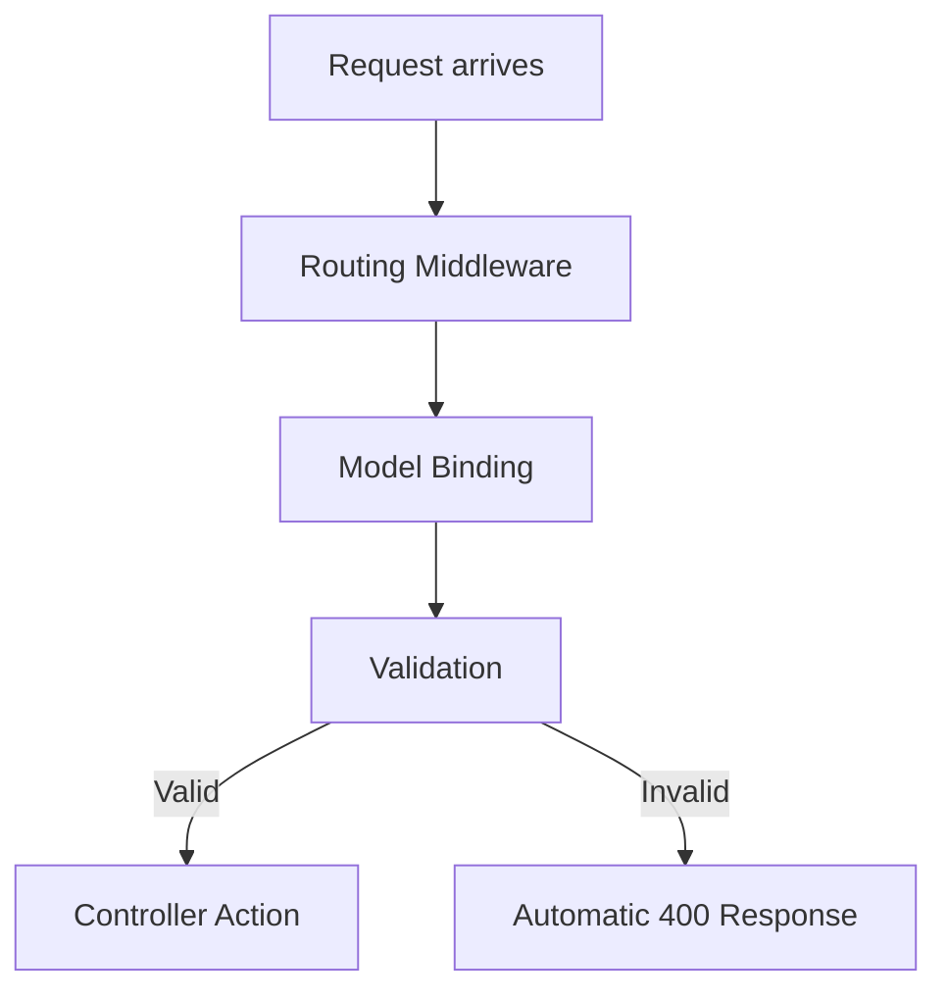

# API Validation in ASP.NET Core

This document covers **all aspects of request validation in ASP.NET Core Web APIs**, including built-in validation, custom validation, and pipeline behavior.

---

## 1️⃣ Overview

Validation ensures that the API **receives correct and safe data**. It prevents invalid data from reaching the business logic layer, reducing errors and improving security.

Types of validation in ASP.NET Core:

1. **Model validation** (using Data Annotations)
2. **Custom validation attributes**
3. **FluentValidation**
4. **Manual validation in controllers**
5. **Global filters for validation**

---

## 2️⃣ Built-in Model Validation

ASP.NET Core automatically validates models decorated with **Data Annotations**.

### Common Attributes:

| Attribute                      | Description                            |
| ------------------------------ | -------------------------------------- |
| `[Required]`                   | Ensures the property is not null/empty |
| `[StringLength(50)]`           | Limits string length                   |
| `[Range(1, 100)]`              | Validates numeric ranges               |
| `[EmailAddress]`               | Validates email format                 |
| `[RegularExpression("regex")]` | Validates against a regex              |
| `[Compare("OtherProperty")]`   | Compares two properties                |

### Example:

```csharp
public class UserDto
{
    [Required(ErrorMessage = "Username is required")]
    [StringLength(20, MinimumLength = 3)]
    public string Username { get; set; }

    [Required]
    [EmailAddress(ErrorMessage = "Invalid Email")]
    public string Email { get; set; }

    [Range(18, 100, ErrorMessage = "Age must be between 18 and 100")]
    public int Age { get; set; }
}
```

### Controller:

```csharp
[HttpPost]
public IActionResult CreateUser([FromBody] UserDto user)
{
    if (!ModelState.IsValid)
        return BadRequest(ModelState);

    return Ok("User is valid");
}
```

---

## 3️⃣ Automatic Model Validation in ASP.NET Core 3.0+

By default, ASP.NET Core **automatically checks `ModelState`** if `[ApiController]` attribute is applied:

```csharp
[ApiController]
[Route("api/[controller]")]
public class UsersController : ControllerBase
{
    [HttpPost]
    public IActionResult Create(UserDto user)
    {
        // No need to manually check ModelState
        return Ok("Valid User");
    }
}
```

Invalid requests automatically return **400 Bad Request** with validation errors.

---

## 4️⃣ Custom Validation Attribute

You can create custom validation rules:

```csharp
public class NotAdminUsernameAttribute : ValidationAttribute
{
    protected override ValidationResult IsValid(object value, ValidationContext validationContext)
    {
        if (value != null && value.ToString().ToLower() == "admin")
        {
            return new ValidationResult("Username cannot be 'admin'");
        }
        return ValidationResult.Success;
    }
}
```

Usage:

```csharp
public class UserDto
{
    [NotAdminUsername]
    public string Username { get; set; }
}
```

---

## 5️⃣ FluentValidation

A popular alternative library for complex validation:

```csharp
public class UserValidator : AbstractValidator<UserDto>
{
    public UserValidator()
    {
        RuleFor(x => x.Username).NotEmpty().Length(3, 20);
        RuleFor(x => x.Email).EmailAddress();
        RuleFor(x => x.Age).InclusiveBetween(18, 100);
    }
}
```

Register in `Program.cs`:

```csharp
builder.Services.AddFluentValidation(fv => fv.RegisterValidatorsFromAssemblyContaining<UserValidator>());
```

---

## 6️⃣ Validation Pipeline Flow



---

## 7️⃣ Manual Validation in Controller

```csharp
[HttpPost]
public IActionResult UpdateUser([FromBody] UserDto user)
{
    if (string.IsNullOrEmpty(user.Username))
    {
        ModelState.AddModelError("Username", "Username is required");
    }

    if (!ModelState.IsValid)
        return BadRequest(ModelState);

    return Ok("User Updated");
}
```

---

## 8️⃣ Global Validation Filter

You can create a **global filter** to handle all validation:

```csharp
public class ValidateModelAttribute : ActionFilterAttribute
{
    public override void OnActionExecuting(ActionExecutingContext context)
    {
        if (!context.ModelState.IsValid)
        {
            context.Result = new BadRequestObjectResult(context.ModelState);
        }
    }
}

// Register globally
builder.Services.AddControllers(options =>
{
    options.Filters.Add<ValidateModelAttribute>();
});
```

---

## 9️⃣ Summary

✅ ASP.NET Core provides multiple validation options:

* **Data annotations** – simple and automatic
* **Custom attributes** – flexible business rules
* **FluentValidation** – for complex rules
* **Global filters** – centralized validation
* **Manual validation** – full control

Proper validation ensures **robust, secure, and maintainable APIs**.
